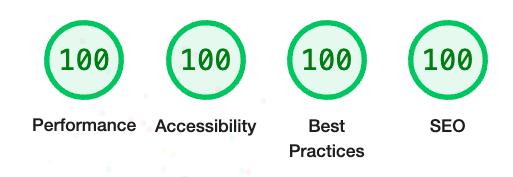
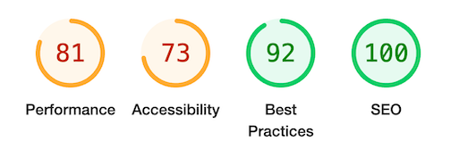
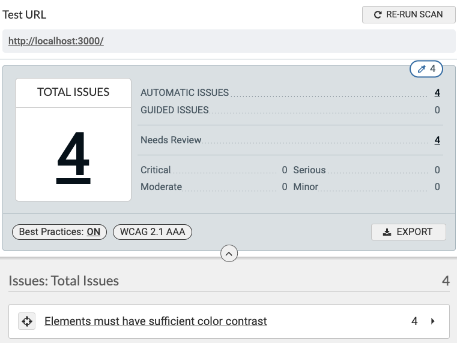
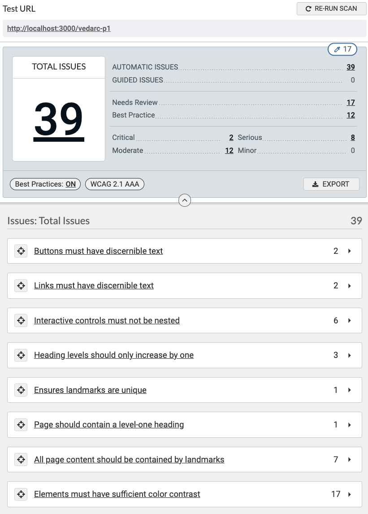
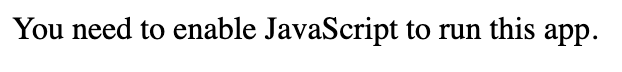
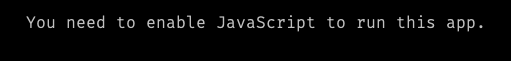
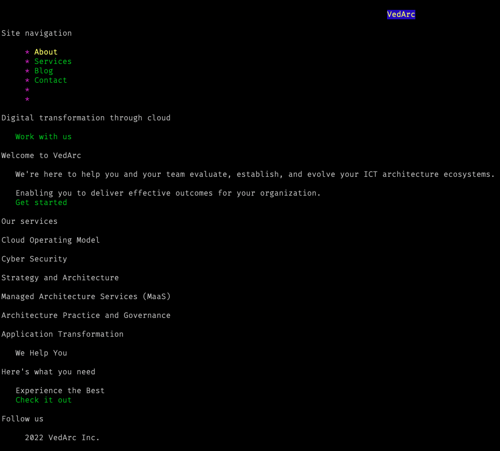
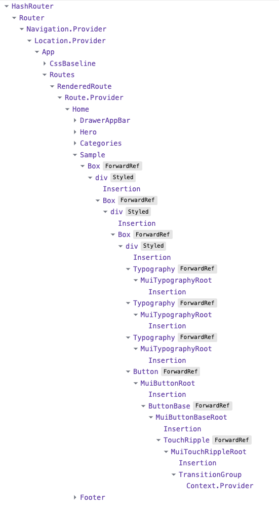

# A comparison

**Comparing the Astro/TypeScript version to the React/MUI version.**

You can open these side-by-side to compare.

- [Astro-TypeScript version](./astro-typescript.md)
- [React-MUI version](./react-mui.md)

## Performance

The Astro version is clean and fast. With a bit of color-tweaking for contrast,
here is the Lighthouse score:



Here is the score for the React-MUI version. This is not too bad, but this is a
very simple page. Performance will go down quickly if the page gets more
complex.



Also note that the React version has to download multiple libraries &ndash;
react, react-router, emotion, mui, etc. &ndash; and a huge amount of extra,
unnecessary CSS and JS, whereas the Astro version has **none**: only the code we
write ourselves. This is an enormous benefit of this approach. For such a simple
site, why do so much heavy lifting?

It doesn't get any better than that.

## Accessibility and usability

Similarly, [axe DevTools](https://deque.com/axe/devtools/), the premier
accessibility tool, reports zero errors (but requires four checks because of the
transparency of some backgrounds):



Note that the **errors** &ndash; Critical, Serious, Moderate, and Minor &ndash;
are all 0. And the 4 issues to check are the semi-transparent backgrounds, which
I have tightened up just enough to ensure that contrast is sufficient for AAA
accessibility.

By comparison, here is the MUI page:



Twenty-two _errors_ in total, and seventeen items to review.

Most of these issues &ndash; **2 Critical** and **8 Serious** as well as 12
Moderate &ndash; can probably be fixed pretty easily. But several of them are
essentially built in to MUI and require a lot of work to hack around. And that
still doesn't address the semantic issue or the heavy bandwidth or having to do
everything the "MUI way" or being stuck with the MUI look and feel which is
boring and ubiquitous. And doubly unnecessary as Hollie can give you a bespoke
look at we can easily code it with simple HTML, CSS, and a touch of JS.

## Legacy issues

The Astro version (while not yet complete), will work well with VoiceOver or
equivalent. It will also work with JavaScript disabled. In fact, the page looks
the same (however, the drawer hasn't been implemented and that's a bit trickier,
though it can work even without JS).

By comparison, turn off JS and here is what the React site looks like:



Not very useful, huh? Sure, you can use SSR (a huge pain to set up, and you have
to run an expensive server), or SSG (recommended), but without JS enabled you
still lose all the benefits of the fancy MUI, whereas there are ways around that
with plain HTML and CSS if you don't mind extra page loads.

Here is what the React version looks like in the Lynx text-only browser. Same
problem...



By comparison, here is the Astro version in Lynx. (The "invisible" icons are
easily fixed.)



I could easily make the service a list (but still look the same to visual
users).

## Them nesting issues

Finally, take a peek at this:



That is **just the Sample Section** component tree as viewed with React
DevTools. Here is what that looks like on the page:


Seriously? This simple box and background image requires all those components?

And that's not the worst. One section is nested **44 levels deep!** To no
benefit whatsoever.

The reason it does is because MUI _has to permit the user to do **anything**_.
In short, it is abstracted to the hilt. And that means lots and lots of stuff
you **don't need** just because someone else might. MUI is _one-size-fits-all_.

Maybe, but not well.

In other words, you are building an 80% _generic_ site just so everyone can use
MUI for everything _even though you don't need any of that_. Only a small
portion of your code is bespoke &ndash; specific to _your_ site.

In contrast, here is the same code but in the Astro version. No React
components, no wrappers, no "Insertions" or "ForwardRefs". Just plain HTML and
CSS:

```html
<section class="box">
  <div>
    <p class="pre">We Help You</p>
    <h2>Here's what you need</h2>
    <p>Experience the Best</p>
    <a class="call-to-action tertiary" href="/check-it-out">Check it out</a>
  </div>
</section>
```

Here, in contrast, is what MUI puts out:

```html
<div>
  <div class="MuiBox-root css-17aho8q">
    <div class="MuiBox-root css-y4o519" align="center">
      <div class="MuiBox-root css-xelx1c">
        <h5
          class="MuiTypography-root MuiTypography-h5 MuiTypography-alignCenter css-okm0i5-MuiTypography-root"
        >
          We Help You
        </h5>
        <h3
          class="MuiTypography-root MuiTypography-h3 MuiTypography-alignCenter css-47suzj-MuiTypography-root"
        >
          Here's what you need
        </h3>
        <h6
          class="MuiTypography-root MuiTypography-h6 MuiTypography-alignCenter css-1poslcw-MuiTypography-root"
        >
          Experience the Best
        </h6>
        <button
          class="MuiButtonBase-root MuiButton-root MuiButton-contained MuiButton-containedSecondary MuiButton-sizeMedium MuiButton-containedSizeMedium MuiButton-root MuiButton-contained MuiButton-containedSecondary MuiButton-sizeMedium MuiButton-containedSizeMedium css-1aqsytz-MuiButtonBase-root-MuiButton-root"
          tabindex="0"
          type="button"
          textalign="center"
        >
          Check it out<span
            class="MuiTouchRipple-root css-8je8zh-MuiTouchRipple-root"
          ></span>
        </button>
      </div>
    </div>
  </div>
</div>
```

Here (and this is probably a developer error, but MUI encourages it), `h3`,
`h5`, and `h6`, which are _headings_ are being used to force larger type. This
is totally the wrong approach and definitely in the list of accessibility
errors.

Then there is a button. But a button is used for adding _behavior_ to a page,
such as submitting a form or opening and closing a drawer. When the "button" is
actually a link to another site page, then the proper semantic HTML is an anchor
(`a`) element, as shown in the Astro example. It can still _look_ like a button.

And guess what! This button _depends on JavaScript to work_, so if JS is
disabled, it does nothing. The `a` element works just fine without JS.

There is a great deal more to say, but this is probably already more than you
wanted to know...

You can easily make this site "work" with React and MUI and React Router.
